## How to use

This driver is intended to work with devices that use **0xEF00** Tuya Cluster

### Install the driver

1. Accept the invitation ( https://api.smartthings.com/invite/6Vjd4YPVJwjN )
2. Enroll the hub
3. List available drivers
4. Install the driver ( Personal Tuya Devices )

### Pair the device

1. Open SmartThings App
2. Search for nearby devices
3. Set the device in pairing mode

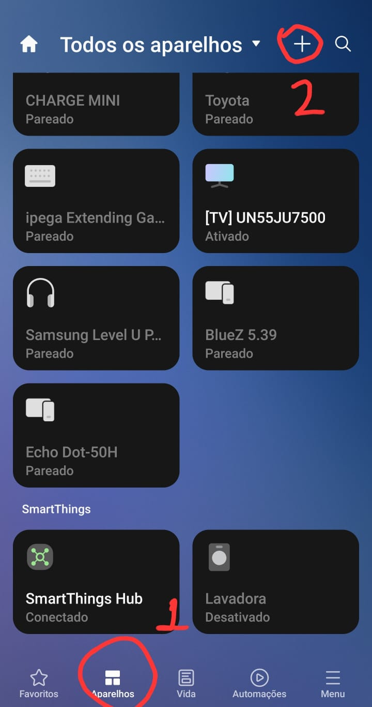 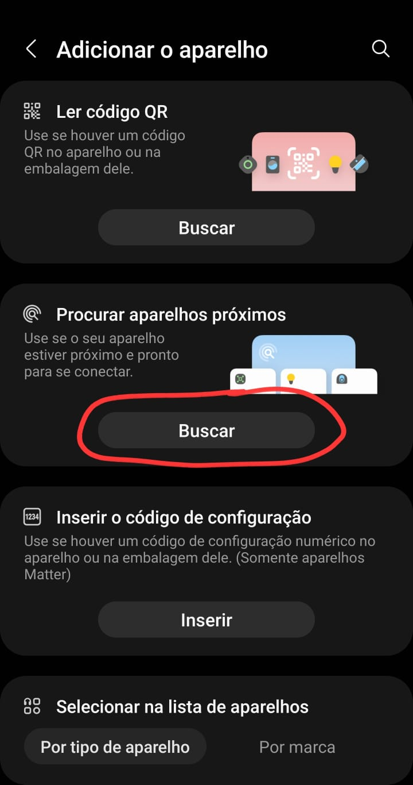 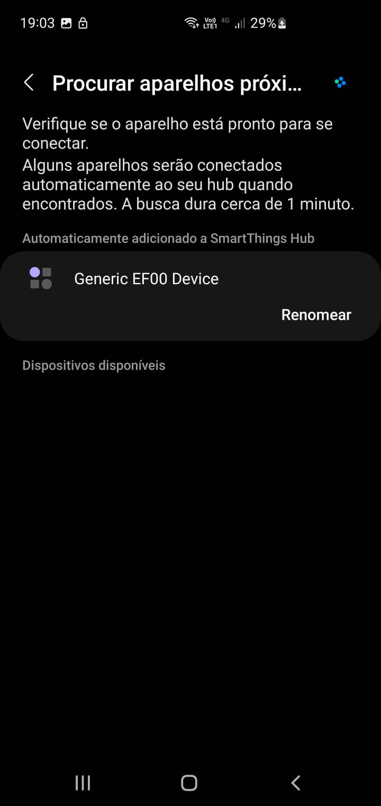 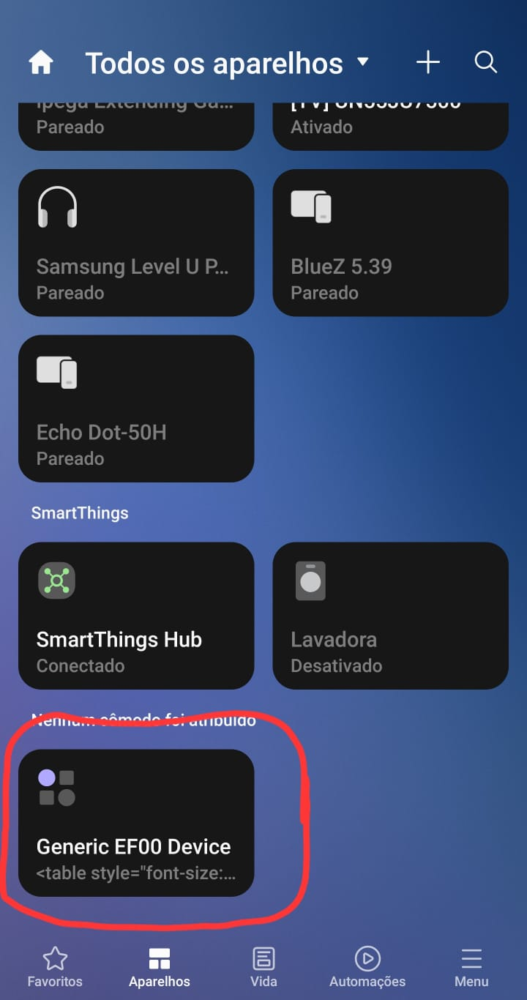

### Configure datapoints

1. Open the detail view of the device
2. Open configurations
3. Fill the fields that meets the specified for the device
   - Search the internet about your device details (manufacturer and model)
   - You will find the same device or very similar ones working on other systems (Home Assistant, Hubitat, old Groovy DTHs, ...)
   - Similar devices usually use the same datapoints
   - There are configurations for some stock capabilities 
     Currently: switch, switchLevel, button, contactSensor, doorControl, illuminanceMeasurement, motionSensor, presenceSensor, relativeHumidityMeasurement, temperatureMeasurement and waterSensor
   - Also, there are configurations for generic Tuya Data Types 
     Currently: boolean (switch/sensors), enumeration, value, string, bitmap and raw
   - For example:
     - If you know the datapoint 1 is for a writable boolean, then add it to "Datapoints for switches"
     - If you know the datapoint 2 is for a read-only boolean, then add it to any sensor

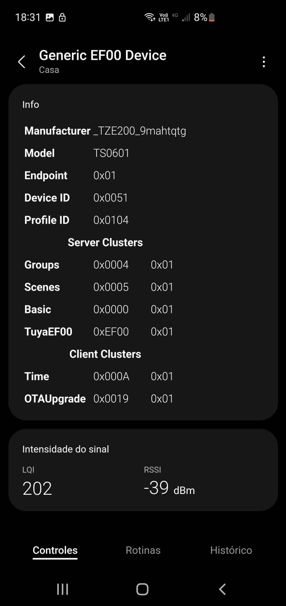 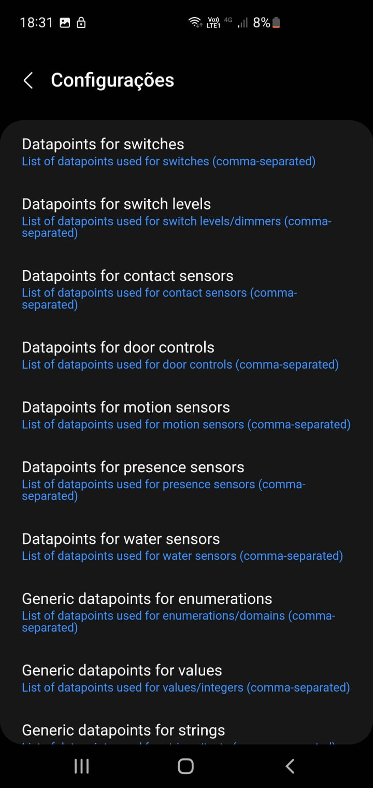 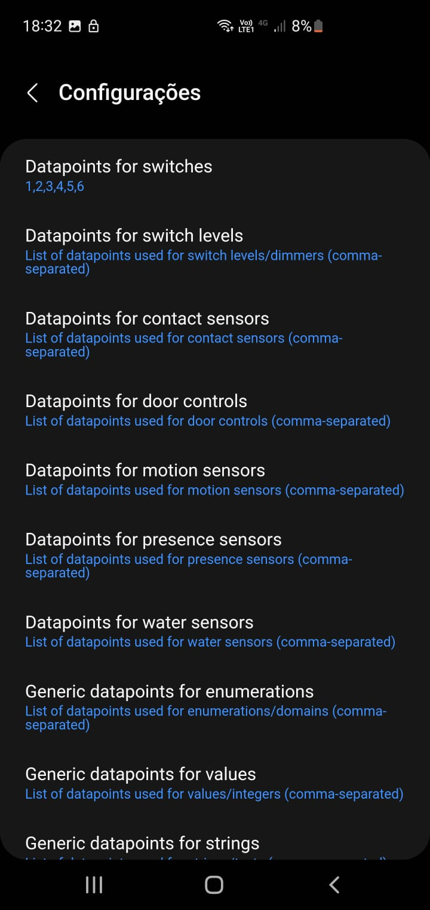  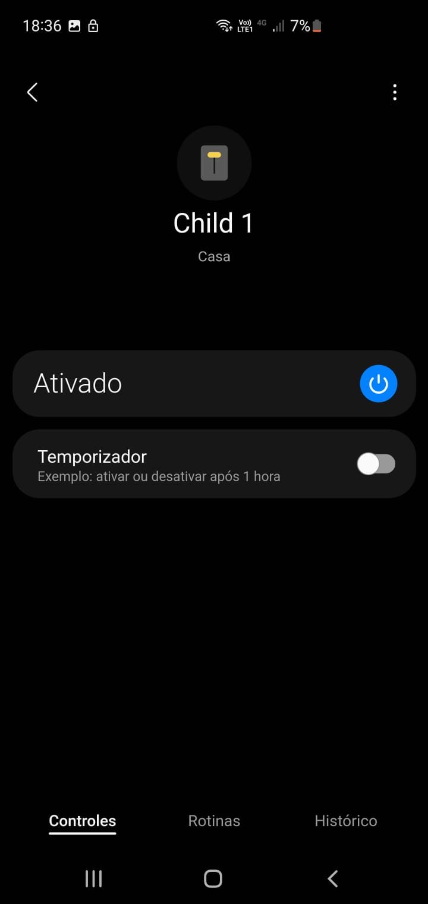

### Contribute with your integration

1. Once you know exactly how your device works with each available datapoints, consider forking the repository and adding the code needed to make it a little more user friendly.
2. Create or use existing folder with model name at `/src/sub_drivers` 
   - The model name must be the value reported by the device as seen in the screenshot above, not what is labeled in the box.
   - If model name folder doesn't exist: 
     1. Duplicate `/src/sub_drivers/TEMPLATE` folder and modify all references to the new model name
     2. Add a reference to the new folder at `/src/sub_drivers/model_sub_drivers.lua`
   - If model name folder already exists: 
     1. Map the datapoints of the device at `/src/sub_drivers/MODEL/datapoints.lua`
     2. Create a profile that represents the device at `/profiles/normal-XXXXXXXXXXXXXXXXX-vX.yaml`
     3. Add fingerprint that represents the device at `/fingerprints.yaml`
3. Pull request your modification

### Current devices tested with this driver

| Model  | Manufacturer      | Description      |
| ------ | ----------------- | ---------------- |
| TS0601 | \_TZE200_1n2kyphz | 4 multi switches |
| TS0601 | \_TZE200_9mahtqtg | 6 multi switches |
| TS0601 | \_TZE200_e3oitdyu | 2 multi dimmers  |
| TS0601 | \_TZE200_r731zlxk | 6 multi switches |
| TS0601 | \_TZE200_wfxuhoea | garage door      |

### Known issues

- **Some child devices weren't created** 
  Sometimes, when modifying configurations, some child devices aren't created. 
  It seems there is a reason to name the function as `driver:try_create_device(...)` 
  The driver can't do much about it, but try again. 
  Just change datapoint orders to force updating configuration. 
  For example, something like "1,2" to "2,1"

  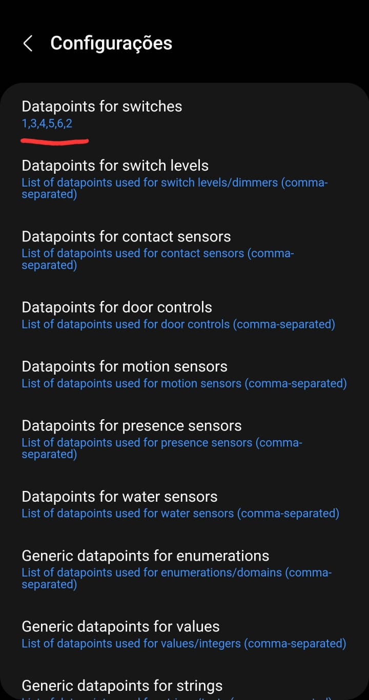

- **Child dashboard/detail view didn't load properly** 
  The driver doesn't know the datapoints until user inform them. 
  It will update as soon as it receives data from the device. 
  If there are some physical interface with the device (like switches, buttons, sensors, ...), consider triggering it. 
  It should make the device send informations to the driver. 
  I still don't know how to request data without modifying it as a side effect. Ideas are welcome.

  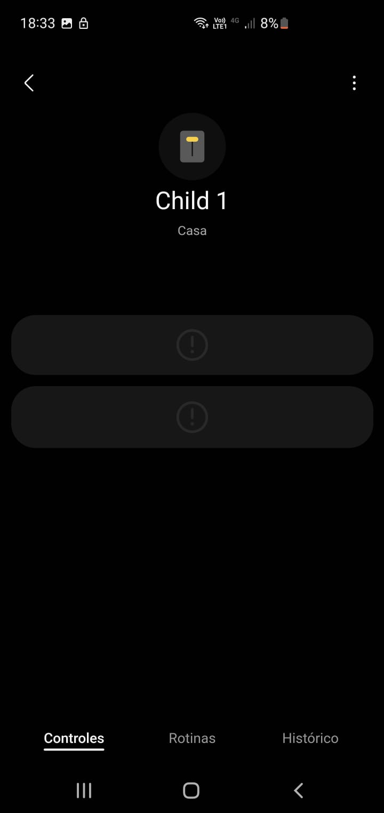

- **Presentation didn't change** 
  Sometimes, when modifying presentation, it doesn't update properly. 
  It seems there is a reason to name the function as `device:try_update_metadata(...)` 
  The driver can't do much about it, but try again. 
  Just change to other presentation and revert to force updating presentation.

  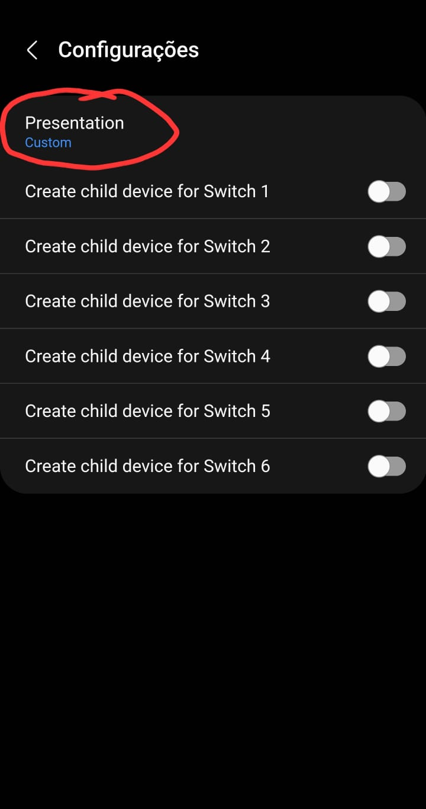

### Currently untested configurations

- Humidity Sensor
- Illuminance Sensor
- Motion Sensor
- Water Sensor
- String Tuya Data Type
- Bitmap Tuya Data Type
- Raw Tuya Data Type
