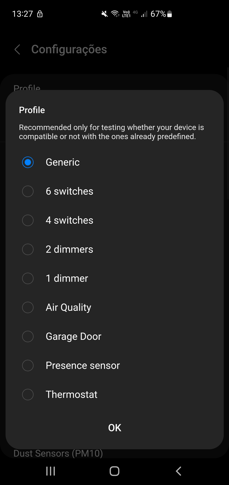

- [SmartThings Community Discussion](https://community.smartthings.com/t/st-edge-personal-tuya-devices-generic-ef00-device/255270?u=w35l3y)
- [Invitation link](${{ env.INVITATION_LINK }})

## How to use

This driver is intended to work with devices that use **0xEF00** Tuya Cluster

### Install the driver

1. Accept the invitation ( ${{ env.INVITATION_LINK }} )
2. Enroll the hub
3. List available drivers
4. Install the driver ( Personal Tuya Devices )

### Pair the device

1. Open SmartThings App
2. Search for nearby devices
3. Set the device in pairing mode

   

### Configure for similarity - beginner mode (only if your device was not recognized automatically and you want to test a predefined device)

1. Open the detail view of the device
2. Open configurations
3. Select the profile that best match with the type of your device and confirm

If it doesn't update the profile, please read Known issues.

### Configure datapoints - advanced mode (only if your device was not recognized automatically)

1. Open the detail view of the device
2. Open configurations
3. Fill the fields that best match the specified for your device
   - Search on the internet about your device details (manufacturer and model)
   - You will find the same device or very similar ones working on other systems (Home Assistant, Hubitat, old Groovy DTHs, ...)
   - Similar devices usually use the same datapoints (it is NOT a rule!)
   - There are configurations for some stock capabilities 
     Currently: switch, switchLevel, airQualitySensor, button, carbonDioxideMeasurement, contactSensor, doorControl, dustSensor, fineDustSensor, formaldehydeMeasurement, illuminanceMeasurement, motionSensor, occupancySensor, presenceSensor, relativeHumidityMeasurement, temperatureMeasurement, tvocMeasurement, valve, veryFineDustSensor and waterSensor/leakSensor
   - Also, there are configurations for generic Tuya Data Types 
     Currently: boolean (switch/binary sensors), enumeration, value, string, bitmap and raw
   - For example:
     - If you know the datapoint 1 is for a writable boolean (actuator), then add it to "Datapoints for switches"
     - If you know the datapoint 2 is for a read-only boolean (sensor), then add it to any binary sensor

    

## Contribute with your integration

1. Once you know exactly how your device works with each available datapoints, consider forking the repository and adding the code needed to make it a little more user friendly.
2. Create a file representing your device at `/models/<model>/<manufacturer>.yaml` 
   - You may use any of the existing files as template.
   - Possible commands are at `/src/commands.lua`.
   - If you need a new profile, then create it at `/profiles/normal-XXXXXXXXXXXXXXXXX-vX.yaml`
3. Execute `npm start` to test locally
   - All required files are created/modified with this command.
   - Don't bother modifying `fingerprints.yaml` manually.
   - Re-execute it every time you modify your model file to create/modify files properly. Otherwise, you may have inconsistent results.
4. Pull request your modification

### Examples of including predefined devices:

- https://github.com/w35l3y/EdgeDrivers/commit/47b55df44d73fb6faf3db1b5e6965aadf2c62ac7
- https://github.com/w35l3y/EdgeDrivers/commit/9b9448c8f46ec47a82034809d7a25c580df7d4cf (created new profile)
- https://github.com/w35l3y/EdgeDrivers/commit/e51cd5fcd3a2e096d2289074a3a44c976348ec93
- https://github.com/w35l3y/EdgeDrivers/commit/0fe4849b5bffe7b52bac84cbc71a55b6bae3b0a5
- Each file here is an example: https://github.com/w35l3y/EdgeDrivers/tree/beta/personal-tuya-devices/models/TS0601

Once you include/modify your model file, execute the command `npm start` to generate other files.

### Examples of including new stock capabilities:

- https://github.com/w35l3y/EdgeDrivers/commit/f4827edd743b4cd544199812226755c32ec5cde6 (+ unit tests)
- https://github.com/w35l3y/EdgeDrivers/commit/1c6708f6c48790cae2be812ad668a01c71884836
- https://github.com/w35l3y/EdgeDrivers/commit/013d41ca525106162134223fb2cd826b5bc01918
- https://github.com/w35l3y/EdgeDrivers/commit/cdf8a6f023cd4b54fcc60136f3c9885164bae14f

## Current devices tested with this driver

<!-- include ./DEVICES.md -->

## Known issues

- **Some child devices weren't created** 
  Sometimes, when modifying configurations, some child devices aren't created. 
  It seems there is a reason to name the function as `driver:try_create_device(...)` 
  The driver can't do much about it, but try again. 
  Just change datapoint orders to force updating configuration. 
  For example, something like "1,2" to "2,1"

  

- **Child dashboard/detail view didn't load properly** 
  The driver doesn't know the datapoints until user inform them. 
  It will update as soon as it receives data from the device. 
  If there are some physical interface with the device (like switches, buttons, sensors, ...), consider triggering it. 
  It should make the device send informations to the driver. 
  I still don't know how to request data without modifying it as a side effect. Ideas are welcome.

  

- **Profile didn't change** 
  When modifying profile, it didn't update profile properly. 
  Sometimes, it is just cache. 
  Return to the dashboard page in the app and go to device detail view. It may require to do more than once or even closing the app. 
  It seems there is a reason to name the function as `device:try_update_metadata(...)` 
  The driver can't do much about it, but try again. 
  You may also change to a random profile and revert it to force updating profile.

  

## Currently untested configurations

- Door Control
- Illuminance Sensor
- Motion Sensor
- Occupancy Sensor
- Water Valve
- Water Sensor
- String Tuya Data Type
- Bitmap Tuya Data Type
- Raw Tuya Data Type
