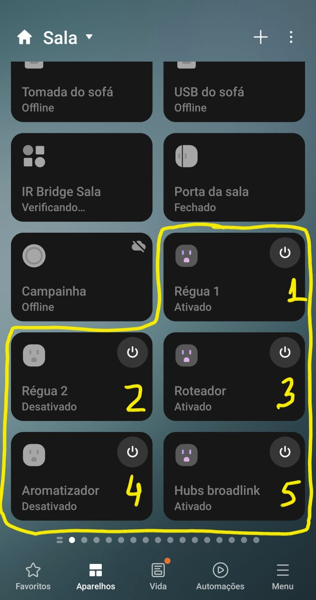
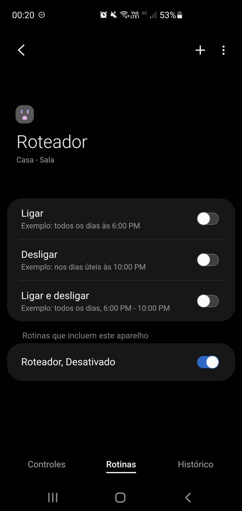
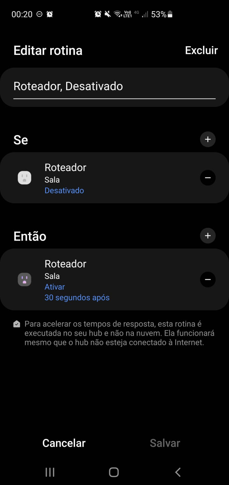

# Zigbee Smart Plug with child devices

Due to current limitation in the API 40.x that [child devices can only be of type LAN][5], the goal was to create child devices of type LAN that mimic zigbee devices.

During development, I realized that ["parent_device_id" can't be defined when mixing device types][1]. Otherwise, the child devices wouldn't show up. So the side effect is child devices aren't really associated to its parent.

The other situation that seems related to the device is that there are 5 endpoints, but that API only recognized 4 of them. [This was causing the 5th component to be offline][3].

I haven't tested usage of the same driver with 2 physical devices at once because I only have one.

## How to use it

1. Access the invitation link informed in the README of the repository
   Click on the link or copy and paste it to your browser
2. Accept it
   Click on "ACCEPT" button
3. Enroll to a hub
   Click on "ENROLL" button of the desired hub
4. Install the driver
   Click on "INSTALL" button of "Zigbee Smart Plug with child devices"

## Screenshots

   

## Known issues

- [App does not respect defined label of the components in the device profiles][4]
- [Removing parent device doesn't revome child devices automatically][1]
- App does not respect definition order of the components in the device profiles

## Known limitations

- If you remove one or more child devices by mistake and want them back, you will need to repair the device
- If you need to repair the device for some reason, you will need to remove each old device/child device one by one

## Related stuff

[[ST Edge] Access to \_envlibrequire(“devices”)][1]

Keywords: child device, parent device id

[[ST Edge] Does this typos affect API functionality ? ( APIv0 Hub Release 40.X )][2]

Keywords: typos, timeout

[[ST Edge] How to update/increase the number of endpoints?][3]

Keywords: missing endpoint

[[ST Edge] Wrong labels in Detail page for custom drivers][4]

Keywords: wrong label

[1]: https://community.smartthings.com/t/st-edge-access-to-envlibrequire-devices/237272/6?u=w35l3y "[ST Edge] Access to _envlibrequire(“devices”)"
[2]: https://community.smartthings.com/t/st-edge-does-this-typos-affect-api-functionality-apiv0-hub-release-40-x/237673?u=w35l3y "[ST Edge] Does this typos affect API functionality ? ( APIv0 Hub Release 40.X )"
[3]: https://community.smartthings.com/t/st-edge-how-to-update-increase-the-number-of-endpoints/237362/2?u=w35l3y "[ST Edge] How to update/increase the number of endpoints?"
[4]: https://community.smartthings.com/t/st-edge-wrong-labels-in-detail-page-for-custom-drivers/237383?u=w35l3y "[ST Edge] Wrong labels in Detail page for custom drivers"
[5]: https://developer-preview.smartthings.com/edge-device-drivers/driver.html#Driver.try_create_device "Driver.try_create_device"
